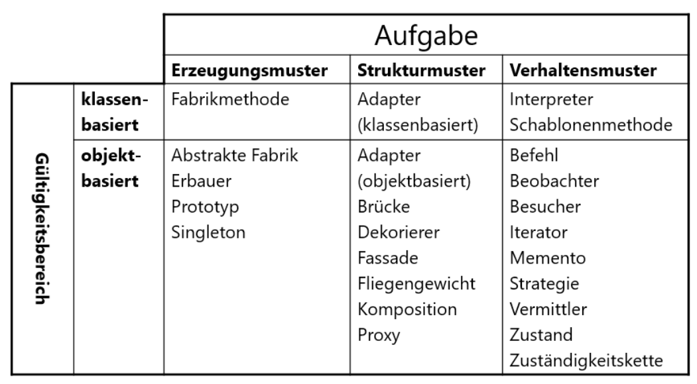

# Design Patterns

**Einführung in das Thema** ***Design Patterns***

---

## Design Pattern - Entwurfsmuster​

- Design-Patterns (oder Entwurfsmuster) sind eine der wichtigsten und interessantesten Entwicklungen der objektorientierten Programmierung der letzten Jahre. ​
- Basierend auf den Ideen des Architekten Christopher Alexander wurden sie durch das Buch "Design-Patterns - Elements of Reusable Object-Oriented Software" von Erich Gamma, Richard Helm, Ralph Johnson und John Vlissides 1995 einer breiten Öffentlichkeit bekannt. ​
- Die Autoren und ihr Buch werden meist als "GoF" bezeichnet, ein Akronym für "Gang of Four" ​

---

## Idee von Design Pattern​

- „Jedes Muster beschreibt ein in unserer Umwelt beständig wiederkehrendes Problem und erläutert den Kern der Lösung für dieses Problem, so dass Sie diese Lösung beliebig oft anwenden können, ohne sie jemals ein zweites Mal gleich auszuführen.“​
- Alexander sprach über Muster in Gebäuden und Städten (Architekt).​
- Diese Idee wurde für objektorientierte Entwurfsmuster übernommen und entsprechend adaptiert.​

---

## Was sind Design Pattern​?

- Als Design-Patterns bezeichnet man (wohlüberlegte) Designvorschläge für den Entwurf von objektorientierter Softwaresysteme. ​
- Ein Design-Pattern deckt dabei ein ganz bestimmtes Entwurfsproblem ab und beschreibt in rezeptartiger Weise das Zusammenwirken von Klassen, Objekten und Methoden. ​
- In einem Design-Pattern sind meist mehrere Algorithmen und/oder Datenstrukturen beteiligt. ​
- Design-Patterns stellen wie Datenstrukturen (Stack usw.) oder Algorithmen (Insertionsort usw.) vordefinierte Lösungen für konkrete Programmierprobleme dar, allerdings auf einer höheren Abstraktionsebene. 

---

## Grundelemente eines Design-Patterns​

Allgemein betrachtet besitzt ein Muster 4 grundlegende Elemente:​

- Mustername​
- Problemabschnitt​
- Lösungsabschnitt​
- Konsequenzenabschnitt​

---

## Mustername

1. Der Mustername ist ein Stichwort, das benutzt wird, um ein Entwurfsproblem und seine Lösungen und Auswirkungen mit ein oder zwei Worten zu benennen. Durch die Benennung von Mustern erweitern wir unser Entwurfsvokabular, so dass wir lernen auf einer höheren Abstraktionsebene zu entwerfen (ähnlich dem Begriff „Abstrakter Datentyp“ bei Algorithmen). Es erleichtert uns, über Entwürfe nachzudenken und ihre Vor.- und Nachteile anderen zu vermitteln.​

---

## Problemabschnitt

2. Der Problemabschnitt beschreibt, wann das Muster anzuwenden ist, welches Problem adressiert wird und was sein Kontext ist. Es beschreibt mögliche spezifische Entwurfsprobleme, beispielsweise wie Algorithmen als Objekte zu repräsentieren sind. In diesem Abschnitt können auch Bedingungen angegeben sein, die erfüllt sein müssen, wenn die Anwendung des Musters sinnvoll sein soll.​

---

## Lösungsabschnitt

3. Der **Lösungsabschnitt** beschreibt die Elemente, aus denen der Entwurf besteht, so wie ihre Beziehungen, Zuständigkeiten und Interaktionen. Die Lösung beschreibt weder einen bestimmten Entwurf noch eine bestimmte Implementierung, sondern vielmehr eine Schablone, die in vielen verschiedenen Situationen angewendet werden kann (-> Unabhängig von der gewählten Programmiersprache).​

---

## Konsequenzenbschnitt​

4. Der **Konsequenzenabschnitt** beschreibt die Konsequenzen der Musteranwendung durch die Auflistung der Vor.- und Nachteile des resultierenden Entwurfs. Oft sind die Konsequenzen unausgesprochen. Sie sind jedoch von zentraler Bedeutung für die Bewertung von Entwurfsalternativen und für das Verständnis der Vor.- und Nachteile der Musteranwendung.​

---

## Katalogisierung von Mustern​

- Da es eine Vielzahl von Entwurfsmuster gibt, müssen diese auch entsprechend organisiert werden. ​
- Die Muster werden mittels 2 Kriterien klassifiziert.​
  - Durch die Aufgabe – diese gibt an, was das Muster macht. Ein Muster kann eine erzeugende, eine strukturorientierte oder eine verhaltensorientierte Aufgabe haben.​
  - Durch den Gültigkeitsbereich – dieser gibt an, ob sich Muster primär auf Klassen oder Objekte bezieht.​

---

## Katalogisierung von Mustern II

