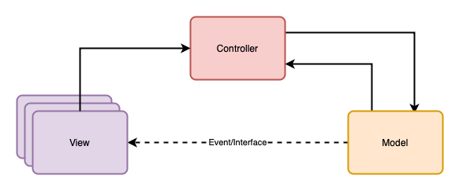

# MVC-Pattern in C#

Das **Model-View-Controller (MVC)**-Pattern ist ein weit verbreitetes Softwarearchitektur-Muster, das dazu dient, die Struktur von Anwendungen zu organisieren und die Verantwortlichkeiten klar zu trennen. Es wird häufig in der Entwicklung von Web- und Desktop-Anwendungen eingesetzt, um die Wartbarkeit, Testbarkeit und Erweiterbarkeit des Codes zu verbessern.

---

## Was ist das MVC-Pattern?

Das MVC-Pattern besteht aus drei Hauptkomponenten:

* **durchgezogene Line** stellt eine direkte Verbindung dar
  * (Objekte sind miteinander verbunden)
* **gestrichelte Linie** stellt eine indirekte Verbindung dar
  * (Objekte sind über Schnittstellen und/oder Events miteinander verbunden)

---

### 1. Model

Das **Model** repräsentiert die Daten und die Geschäftslogik der Anwendung. Es ist für folgende Aufgaben verantwortlich:

* Speichern und Verwalten von Anwendungsdaten.
* Verarbeitung der Geschäftslogik.
* Benachrichtigung der Views über Änderungen der Daten.

**Beispiele:**

* Datenbankmodelle oder Objekte, die die Datenstruktur abbilden.
* Methoden, die Berechnungen durchführen oder Daten verarbeiten.

---

### 2. Views

Die **Views** sind für die Darstellung der Daten zuständig. Sie präsentiert dem Benutzer die Informationen und reagiert auf Änderungen im Model.

* Sie ist passiv und empfängt Updates vom Model.
* Sie enthält keine Geschäftslogik.
* Sie leiten Eingaben an den Controller weiter.

**Beispiele:**

* HTML-Templates in Webanwendungen.
* GUI-Komponenten in Desktop-Anwendungen (z. B. Buttons, Listen, Tabellen).

---

### 3. Controller

Der **Controller** dient als Vermittler zwischen Model und View. Er nimmt Benutzereingaben entgegen, verarbeitet diese und aktualisiert das Model oder die View entsprechend.

* Er übersetzt Benutzerinteraktionen in Aktionen.
* Verarbeitet Anfragen und koordiniert die Zusammenarbeit zwischen Model und View.

**Beispiele:**

* Verarbeitung von HTTP-Requests in einer Webanwendung.
* Event-Handler in einer GUI-Anwendung.

---

## Ablauf im MVC-Pattern

1. Der Benutzer interagiert mit der **View** (z.B.: durch einen Klick oder eine Eingabe usw.).
2. Die **View** sendet die Benutzeraktion an den **Controller**.
3. Der **Controller** verarbeitet die Eingabe, führt Logik aus und aktualisiert das **Model**.
4. Das **Model** aktualisiert seine Daten und benachrichtigt die **Views** über die Änderungen.
5. Jede einzelne **View** wird neu gerendert und präsentiert die aktualisierten Daten dem Benutzer.

---

## Vorteile des MVC-Patterns

* **Trennung der Verantwortlichkeiten:** Jede Komponente hat eine klar definierte Rolle, was die Wartung und das Testen erleichtert.
* **Wiederverwendbarkeit:** Die View kann unabhängig vom Model wiederverwendet werden.
* **Erweiterbarkeit:** Neue Funktionen können leichter hinzugefügt werden, ohne bestehende Komponenten stark zu beeinflussen.

---

## Beispiele für MVC-Frameworks

* **Web:**
  * Ruby on Rails (Ruby)
  * Laravel (PHP)
  * Spring MVC (Java)
  * Django (Python)
* **Desktop:**
  * JavaFX (Java)
  * .NET Framework (C#)

---

## Umsetzung in C#

Das Pattern wird natürlich in Abhängigkeit der Möglichkeit einer Programmiersprache entsprechend umgesetzt. Eine mögliche Umsetzung in C# finden Sie unter den Link: [MVC-Pattern mit C#](https://github.com/leoggehrer/MVCPattern)

---

## Fazit

Das MVC-Pattern ist ein leistungsstarkes Konzept, das Entwicklern hilft, sauberen und modularen Code zu schreiben. Es ist besonders nützlich in Anwendungen mit komplexen Benutzeroberflächen und Geschäftslogik. Durch die klare Trennung der Komponenten können Teams effizienter zusammenarbeiten und Projekte schneller skalieren.
