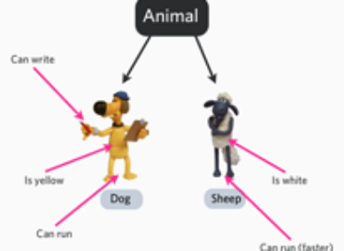
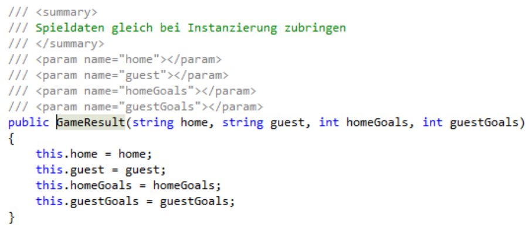

## Grundlagen der objektorientierten Programmierung OOP

OOP steht für Objektorientierte Programmierung. Es handelt sich dabei um ein Programmierparadigma, bei dem Software in Form von Objekten strukturiert wird. Diese Objekte repräsentieren sowohl Daten als auch das Verhalten, das mit diesen Daten verknüpft ist.

---

## Konzepte von OOP

- **Klassen und Objekte:** 
  - Eine Klasse ist eine Vorlage oder ein Bauplan für Objekte. Sie definiert die Eigenschaften (Daten) und Methoden (Funktionen), die ein Objekt haben kann.
  - Ein Objekt ist eine Instanz einer Klasse. Es ist ein konkretes Exemplar und kann eigene Werte für die Eigenschaften der Klasse haben.
- **Vererbung:**
  - Vererbung ermöglicht es, dass eine Klasse Eigenschaften und Methoden einer anderen Klasse übernehmen kann. Dadurch können Klassen hierarchisch organisiert und gemeinsame Funktionalitäten geteilt werden.

---

## Konzepte von OOP II

- **Kapselung:**
  - Bei der Kapselung werden Daten und Funktionen innerhalb eines Objekts verborgen (privatisiert), sodass sie von außen nur über definierte Schnittstellen (Methoden) zugänglich sind. Dies fördert die Sicherheit und Integrität der Daten.
- **Polymorphismus:**
  - Polymorphismus bedeutet, dass eine Methode in verschiedenen Klassen unterschiedliche Implementierungen haben kann. Dadurch kann der gleiche Methodenaufruf je nach Kontext (z. B. Objektklasse) unterschiedliche Ergebnisse liefern.

---

## Vorteile der OOP

- **Wiederverwendbarkeit:**
  - Durch Vererbung und Klassenstrukturen können einmal geschriebene Codeabschnitte wiederverwendet werden.

- **Modularität:**
  - OOP fördert die Strukturierung von Code in kleine, verständliche und austauschbare Bausteine.

- **Wartbarkeit:**
  - Änderungen an einem Teil des Codes sind einfacher durchzuführen, da jedes Objekt unabhängig behandelt werden kann.

---

## Programmentwicklung in der Einführung

- Lesen und Verstehen der Aufgabenstellung
- Entwurf eines geeigneten Algorithmus
- Umsetzen des Algorithmus in **C#** mit den Grundelementen
- Testen der Anwendung

---

## Entwurf eines geeigneten Algorithmus

- Nutzung grafischer Hilfsmittel (Ablaufdiagramm, …) zur Visualisierung der Lösungsidee
- Strukturieren der Lösung durch schrittweise Verfeinerung
- Durchspielen des Algorithmus mit Hilfe von Schreibtischtests

---

## Umsetzen des Algorithmus in C#

- Codieren unter Berücksichtigung der vorgegebenen Codierrichtlinien
  - Sprechende Bezeichner
  - Verwendung der passenden Datentypen für Variable und Parameter
  - XML-Kommentare für alle Methoden
  - Kommentare für Codeteile, die nicht selbst erklärend sind 
    - Zuerst prüfen, ob der Code nicht durch andere Bezeichnernamen und/oder einfachere Ablaufstrukturen verbessert werden kann
- Syntaxfehler und Warnungen beheben
  - Meldungen des Compilers genau lesen und entsprechende Korrekturen anbringen

---

## Testen der Anwendung

- Falls Unittests vorhanden sind, muss das Programm alle Tests bestehen
  - Änderung von Testfällen ist natürlich nicht zulässig
  - Ergänzung um eigene Testfälle ist erwünscht
  - Testfälle können als Einsprungpunkt für das Debugging verwendet werden
- Funktionsfähigkeit der Anwendung auf Basis der Aufgabenstellung testen
  - Im Fehlerfall, Debugger verwenden

---

## Strukturierung des Programms

- Methode soll eine abgeschlossene Aufgabe erfüllen
- Der Name der Methode beschreibt möglichst selbsterklärend deren Aufgabe
  - Bei statischen Methoden besteht der **Name** aus zumindest zwei Teilen:
    - WAS   ➔ Verb (z.B. WriteLine)
    - WOMIT ➔ Nomen (z.B. WriteLine)
- Die Methode soll gut testbar sein
- Alle Standardabläufe und Sonderfälle müssen über Parameter „ansteuerbar“ sein
- Kein Methodenrumpf hat mehr als 50 Zeilen
- Wenn die Parameterliste lang wird, ist die Stelle der Aufteilung vermutlich schlecht gewählt
- Es gibt sehr starke Abhängigkeiten mit dem umliegenden Code

---

## Strukturierug Methode song ll eindes Pe abgeschlrosogrsene Aufammsgabe erfüllen

- Der Name der Methode beschreibt möglichst selbsterklärend deren Aufgabe
  - Bei statischen Methoden besteht der Name aus zumindest zwei Teilen:
    - WAS ➔ Verb (z.B. WriteLine)
    - WOMIT ➔ Nomen (z.B. WriteLine)
- Die Methode soll gut testbar sein
  - Alle Standardabläufe und Sonderfälle müssen über Parameter „ansteuerbar“ sein
- Kein Methodenrumpf hat mehr als 50 Zeilen
- Wenn die Parameterliste lang wird, ist die Stelle der Aufteilung vermutlich schlecht gewählt
  - Es gibt sehr starke Abhängigkeiten mit dem umliegenden Code
  - Formulieren von konkreten Fragen bei etwaigen Unklarheiten

---

## Beispiel: Textfilter für Kleinbuchstaben

- Die Methode realisiert einen einfachen Algorithmus zur Analyse eines Textes. Es sollen aus einem beliebigen Text die Kleinbuchstaben (‚a‘ – ‚z‘, ohne Umlaute) herausfiltert und **aufsteigend sortiert, je Buchstabe einmal** zurückgegeben werden. Alle Zeichen, die keine Kleinbuchstaben darstellen sind im Ergebnistext nicht vorhanden.
- Testfälle:
  - “7h3a5L75“ ➔ “ah“
  - “Es ist jetzt 10:10 Uhr“  ➔ “ehijrstz“ 
  - “xxxxxxxx“  ➔ “x“ 
  - “9876543210“  ➔ ““
  - ““  ➔ ““

---

## Aufgabe: Textfilter für Kleinbuchstaben

- Entwerfen Sie den Methodenkopf mit der entsprechenden Namen, Parameterliste, Rückgabewert und den XML- Kommentaren.
  - Verwenden Sie für alle Bezeichner englische Begriffe. Kommentare dürfen auch in deutscher Sprache formuliert werden.
- Entwerfen Sie den Algorithmus in Form eines Ablaufdiagrammes
- Testen Sie Ihren Algorithmus mit Hilfe eines Schreibtischtests. Verwenden Sie dazu die vorgegebenen Testfälle.
- Implementieren Sie die Methode in C# in einem Projekt StringAnalyze. Realisieren Sie Unittests in einem eigenen Testprojekt und überprüfen Sie zumindest die Testfälle.

---

## Strukturierung der Daten

- Array fasst mehrere Daten des gleichen Typs zu einer sogenannten Collection (Sammlung) zusammen
  - Alle Arrayelemente haben den gleichen Typ
  - Deklaration legt Bezeichner und Typ fest
  - Definition alloziert Platz im Speicher für Array
- Struct fasst Datenelemente unterschiedlichen Datentyps, die logisch zusammengehören, zusammen

---

## Von prozeduralen Pogrammierung zu OOP

- Prozedurale Programmierung
  - Abläufe dominieren den PR-Prozess
    - Strukturierung nach **Methoden** 
  - Daten werden „nebenbei“ verwaltet
- Objektorientierte Programmierung
  - Zusammenfassung von Abläufen und Daten zu Objekten
  - Objekt ist für Teile der Aufgabe „verantwortlich“
    - Kapselt diese Teile

---

## Ziele von OO

- **Wiederverwendbarkeit**
  - Zugriffsschutz durch Kapselung
    - Schnittstelle definiert Möglichkeiten
  - Deltaprogrammierung mittels Vererbung
- **Schnellere und einfachere Entwicklung**
  - Erweiterbarkeit bestehender Klasse **Otto**
  - Testbarkeit durch definierte Schnittstelle

---

## Darstellung von "Otto"


---

## Was macht ein Objekt im wahren Leben aus?

- Zwei Aspekte 
  - Zustand (*state*) ➔ die  „Datensicht“ 
    - Beispiel Hund: Farbe, Größe,  Geburtsdatum, … 
  - Verhalten (*behavior)* ➔ Abläufe (Methoden) 
    - Beispiel Hund: bellt, frisst,  springt, … 



---

## Was ist ein Objekt?

- Fasst mehrere Datenelemente unterschiedlichen Datentyps unter einem neuen Begriff zusammen
- Definiert Methoden, die im Zusammenhang mit dem Objekt sinnvoll sind
  - Geht auch bei Strukturen, wurde aber im ersten Jahr nicht verwendet

---

## Eigenschaften von Objekten

- **Verantwortlichkeit** für (möglichst genau) eine Aufgabe
- **Kapselung**
  - Wie ist von außen nicht sichtbar
  - Führt automatisch zur **Austauschbarkeit**
- Zwei wichtige Sichten auf ein Objekt
  - **Nutzer** 
    - Was kann das Objekt und wie kann ich mit ihm kommunizieren (öffentlich zugängliche Methoden)
  - **Entwickler**
    - Verwaltung der Funktionalitäten im Inneren (Daten, Methoden)

---

## Einfaches Objekt Schueler

- Status, Zustände in C# ➔ Felder:
  - Vorname, Nachname
  - Geburtsdatum
  - Plz, Ort, Adresse
- Verhalten, in C# ➔ Methoden:
  - IsEigenberechtigt
  - WohntNahe
  - IsAelter

---

## Klassen sind Baupläne für Objekte

- Definition von Objekten
  - Informationen ➔ Daten ➔ Felder
    - Zugriffsmodifizierer `private`
  - Verhalten ➔ Funktionalitäten ➔ Methoden
    - Schnittstelle nach Außen ➔ `public`
    - Private Hilfsmethoden sind gewünscht

---

## Klassen sind Schablonen


---

## Instanzierung: Auf Basis von Klassen Objekte erzeugen**


---

## Objekte erzeugen und verwenden

- Mit `new`-Operator wird ein Objekt erzeugt und eine Referenz auf das Objekt zurückgegeben!

```csharp
Pupil pupil = new Pupil();
```

- Mit dem Punkt-Operator kann auf die Methoden oder Eigenschaften zugegriffen werden

```csharp
pupil.FirstName = "Gerhard";
int ageInDays = pupil.CalculateAgeInDays();
```

---

## Methoden

- Methoden implementieren das  Objektverhalten 
- Durch Methoden können die Zustände  eines Objektes verändert werden 
- Der Zugriff auf die  Datenfelder/Attribute eines Objekts ist  nur über die objekteigenen Methoden  oder Properties (später) möglich  (Kapselung) 

---

## Richtiger OO-Entwurf

- Public Methoden realisieren in erster Linie definiertes Verhalten
- Falls nur Getter/Setter ➔ Verhalten muss im „Clientcode“ realisiert werden
  - Redundanz
  - Schlechte Kapselung
- Beispiel Counter:


---

## Zusammenhang Objekt und Klasse

|**Klasse Objekt**|**Object**|
|-----------------|----------|
| Gibt’s genau einmal | Es gibt viele! |
| Beschreibt Objekte | Kann Operationen ausführen |
| - Zustände  | Dynamische Beziehungen und Bindungen | 
| - Verhalten | |
| Statische Beziehung | |
| Schablone für Objekterstellung | |

---

## Zusammenhang Objekt und Klasse II


---

## Konstruktor ➔ Eingriff in Instanzierung

- Syntax
  - Sieht aus wie eine Methode, hat aber keinen **Rückgabewert** (auch nicht void)
  - Heißt genau so wie die Klasse
  - Defaultkonstruktor hat keinen Parameter und wird automatisch erzeugt, wenn kein anderer Konstruktor angelegt wird
  - Mehrere (überladene) Konstruktoren (Varianten) sind möglich
- Bedeutung
  - Möglichkeit der Initialisierung von Feldern
  - Häufig mit Parametern
    - Felder, deren Wert sich nicht mehr ändert

---

## Statt new und Set… ➔ Konstruktor



---

## Kontrollierter Zugriff auf Felder ➔ Properties

- Zusammenfassung einer Getter- und einer Setter-Methoden zu einer Einheit
- Definition eines Properties

```csharp
/// <summary>
/// Property/Eigenschaft zum Zugriff auf den Vornamen.
/// </summary>
public string FirstName
{
  get { return _firstName; }    // Getter
  set { _firstName = value; }   // Setter
}
```

- Verwendung des Properties

```csharp
Pupil pupil = new Pupil();
pupil.FirstName = "Gerhard";
```

---

## Property - Allgemeines

- Kapselt den Zugriff auf ein internes Feld
- Name wie Feldname mit großem Anfangsbuchstaben
- Hat beliebigen Datentyp (meist Typ des Feldes)
- `get`-Bereich ➔ lesender Zugriff
  - Bei Bedarf Berechnungen 
- `set`-Bereich ➔ auf das private Feld schreiben (value enthält den Wert)
  - Häufig Gültigkeitsprüfungen
- „read-only-Properties“ werden bei Bedarf berechnet (kein Setter)

---

## Beispiel für ein berechnetes „read-only“ - Property

```csharp
/// <summary>
/// Wieviele Jahre ist der Schueler heute alt.
/// </summary>
public int YearsOld
{
  get 
  {
    // Jahre ohne Beruecksichtigung von Monat und Tag
    int result = DateTime.Now.Year - _dateOfBirth.Year;
    DateTime whenYearsOld = _dateOfBirth.AddYears(result);

    if (whenYearsOld > DateTime.Now)
    {
      result--;
    }
    return result; 
  }
}
```

---

## Auto-Properties

**Was sind Auto-Properties?**
- **Auto-Properties** (automatische Eigenschaften) sind eine Kurzform zur Definition von Eigenschaften in Klassen.
- Sie ermöglichen es, Eigenschaften ohne explizite Getter- und Setter-Methoden zu definieren.
- Der C#-Compiler generiert im Hintergrund automatisch ein privates Feld für die Eigenschaft.

---

## Beispiel ener Auto-Property

Full-Property (Traditionelle Eigenschaftsdefinition):

```csharp
private string _name;

public string Name
{
    get { return _name; }
    set { _name = value; }
}
```

Auto-Property:

```csharp
public string Name { get; set; }
```

---

## Vorteile von Auto-Properties

1. **Kürzerer Code:** Weniger Codezeilen für eine Eigenschaftsdefinition.
2. **Verbesserte Lesbarkeit:** Auto-Properties sind kompakt und leichter zu verstehen.
3. **Automatisches privates Feld:** Der Compiler generiert automatisch ein privates Feld im Hintergrund.

---

## Nur-Lese und schreibgeschützte Auto-Properties

**Nur-Lese (Lesen innerhalb und außerhalb der Klasse):**

```csharp
public string Name { get; private set; }
```

- Schreibgeschützt: Nur innerhalb der Klasse änderbar.

**Schreibgeschützt während der Initialisierung:**

```csharp
public string LastName { get; init; }
```

**Init-Only:** Wert kann nur während der Initialisierung gesetzt werden.

---

## Initialisierung in Auto-Properties

Seit C# 6.0 können Standardwerte direkt bei der Definition zugewiesen werden.

Beispiel:

```csharp
public string Name { get; set; } = "Unbekannt";
```

---

## Zusammenfassung Auto-Property

- **Auto-Properties** erleichtern das Schreiben und Verwalten von Eigenschaften in C#.
- Kompakte Syntax für einfache Eigenschaftsdefinitionen.
- Nützlich, wenn keine komplexen **Getter**-/**Setter**-Logik erforderlich ist.

