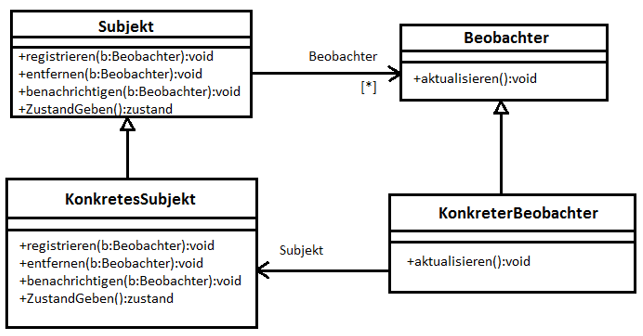

# Observer Pattern in C#

---

## Observer Pattern - Definition

**Observer: (Gang Of Four [GoF], Seite 287)**

Definiere eine **1-zu-n-Abhängigkeit** zwischen Objekten, so dass die Änderung des Zustands eines Objekts dazu führt, das alle abhängigen Objekte benachrichtigt und automatisch aktualisiert werden.

---

## Vorteile

- **Zustandskonsistenz:**
  - Daten bleiben konsistent durch Benachrichtigung bei Änderung der Observer
- **Flexibilität und Modularität:**
  - Viele Observer können ein Subject beobachten
  - Observer muss dem Subject nicht bekannt sein
  - Observer kann sich Anmelden und Abmelden (Subject)
- **Wiederverwendbarkeit:**
  - Subject und Observer können unabhängig voneinander variiren
- **Kompatibilität zum Schichtenmodell:**
  - Subject und Observer sind lose und abstrakt
  - Schichtenmodell bleibt konsistent

---

## Nachteile

- **Aktualisierungskaskaden und –zyklen:**
  - Vielen Subjects und Observer kann es zu Aktualisierungskaskaden kommen
  - Unnötige Aktualisierungen
- **Abmeldung von Observer:**
  - Vergessen zum Abmelden -> unnötiger Aufruf
  - Mehrfache Anmeldung -> eigenartige Nebeneffecte

---

## Beziehungen zwischen den Komponenten

## Umsetzung mit C#

Das Pattern wird natürlich in Abhängigkeit der Möglichkeit einer Programmiersprache entsprechend umgesetzt. So erfolgt die Umsetzung in Java mittels Schnittstellen und in C# mit `Events`. Selbstverständlich kann in C# eine Umsetzung mit Schnittstellen erfolgen. Eine genaue Analyse und Gegenüberstellung finden Sie unter den Link: [Observer-Pattern mit C#](https://github.com/leoggehrer/ObserverPattern)
